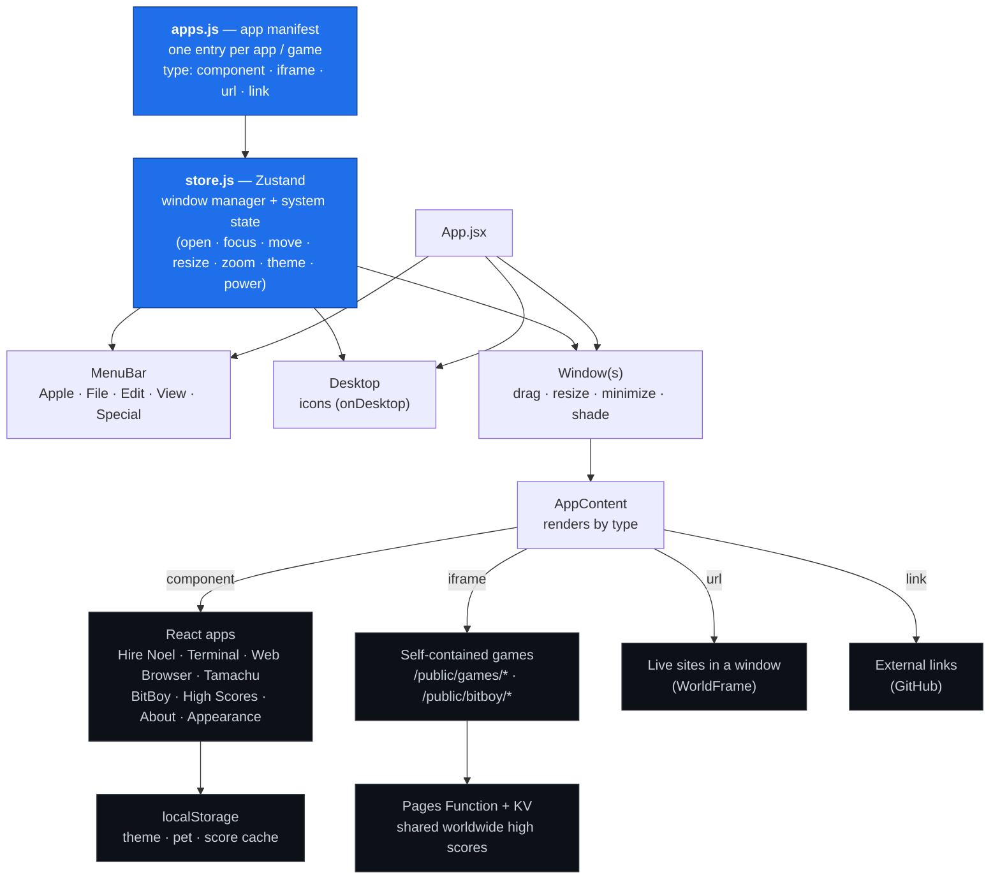

# Noel Jackson — a portfolio built as a working Macintosh

[](https://github.com/nlj3/mac-portfolio/actions/workflows/ci.yml)
&nbsp;[](https://nlj.dev)

**Live:** [nlj.dev](https://nlj.dev)

**Stack:** React 18 · Vite · Zustand · Zod · three.js + cannon-es · Cloudflare Workers · Web Audio

A personal portfolio disguised as a fully working **classic Mac OS 8 "Platinum"
desktop** — draggable windows, a live menu bar, system sounds, theme "flavors",
and a set of real apps and games. Nothing here is a screenshot of my work; every
icon on the desktop *is* the work, running in the browser.

The interesting part for a reviewer isn't the nostalgia skin — it's that the whole
desktop is a small, **pluggable platform**. Apps, games, site-redesigns, and
themes are all registered data; adding a new project to the entire "OS" is a
one-line manifest entry.

---

## Architecture



Everything flows from two files. **`apps.js`** is the manifest — a plain list
describing each app's type, icon, window size, and whether it appears on the
desktop, in the menu, or both. **`store.js`** is a tiny Zustand-based window
manager: it owns open windows, z-order/focus, drag/resize/minimize/window-shade,
the active theme, and the system power state. Everything else (`MenuBar`,
`Desktop`, `Window`, `AppContent`) is a thin view over that state.

Adding a project is one entry:

```js
{
  id: 'my-thing',
  name: 'My Thing',
  category: 'Projects',
  icon: '🛠️',
  type: 'iframe',            // component | iframe | url | link
  src: '/games/my-thing/index.html',
  window: { w: 640, h: 480 },
  onDesktop: true,
  menu: true,
}
```

---

## What's inside

**Apps** (React components running as "native" OS apps)

| App | What it is |
|-----|------------|
| **Hire Noel** *(AI intake pipeline)* | A real lead-capture *pipeline*, not a form. An adaptive wizard (personal vs business → company size) → an **LLM asks the follow-up questions the project actually needs** (2 for a side project, up to 8 deep ones for an enterprise) → a fully-classified lead lands in my **Discord**: **client-tier detection**, an **internal price estimate**, a delivery schedule, and their answers — *all computed server-side so the client never sees a number.* [More below ↓](#featured-build--the-hire-noel-intake-pipeline) |
| **Start Here** | The welcome hub — who I am and where to look first. |
| **Terminal** | A working retro shell over a virtual filesystem: `ls`/`cd`/`cat`, `open <app>` (actually launches apps), `neofetch`, command history, plus a pile of developer easter eggs and a hidden `hack` sequence that unlocks a CTF-style flag. |
| **Web Browser** | An in-OS browser where typing a real domain loads *my redesign* of that site (a pluggable site registry). |
| **High Scores** | A worldwide arcade leaderboard, backed by a Cloudflare Pages Function over Workers KV, with a `localStorage` fallback. |
| **Tamachu** | A full Tamagotchi-style virtual pet — life stages, stats, sickness, discipline, death & rebirth, 3 mini-games, hand-drawn 16×16 sprites, saved across visits. |
| **Appearance** | Control panel to switch between 7 iMac G3 theme "flavors" (live, remembered). |
| **About Me** | The short bio + contact. |

**Games**

| Game | Tech |
|------|------|
| **RC Playground** | A 3D driving time-trial — real physics via **three.js + cannon-es** (suspension, jumps, boost pad, lap timer). |
| **Zenomon** | A deep single-file monster-breeding sim — genome splicing with IV/EV stats, a multi-currency economy, auto-battle, prestige, quests. Vanilla JS, saves locally. |
| **Raid Clicker** | A Tarkov-style extraction-looter incremental — loadouts, survivability, raids, stash, scav runs, season/prestige wipes. |
| **BitBoy** | A working handheld console; its on-screen D-pad/A/B forward real key events into swappable "cartridges" (**Jungle Run**, **Snake**). |
| **Breakout** | The arcade classic, wired into the shared leaderboard. |

---

## Featured build — the "Hire Noel" intake pipeline

The most architecturally interesting piece: a lead-capture *pipeline* that's part
adaptive UX, part LLM orchestration, part edge backend — built so the client gets a
smooth, no-price experience while I get a fully-qualified, priced lead.

**The flow:**
- **Adaptive intake.** "Who's this for?" → personal vs business → *(business)*
  company size. That branch drives everything downstream.
- **AI asks what the project needs.** A [Cloudflare Worker](worker/) calls Groq
  (Llama 3.3) to generate the follow-up questions *this specific project* needs to
  be scoped — as many as it takes: ~2 for a personal side project, up to **8 deeper
  ones** (stakeholders, integrations, compliance, procurement) for an enterprise.
- **Two audiences, one pipeline.** The client sees a clean brief, a "what I'll need
  from you" checklist, and a *"Sent ✓"* confirmation. I receive — in **Discord** —
  the full lead plus a **client-tier classification**, an **internal price
  estimate**, and a delivery schedule.
- **The price is Noel-only by construction.** Tier (email domain + self-reported
  size) *and* the estimate (hours × per-build-type rate × tier multiplier) are
  computed **inside the Worker** and posted to Discord — they're never returned to
  the browser, so a client can't see them even in devtools.

**Why it's built this way:**
- **Deterministic core + AI enrichment.** A pure builder (`brief.js`) is the
  backbone; the LLM adds tailored questions and prose; the pricing/tier math is
  plain, auditable server-side logic.
- **Zod at every boundary** — intake *in*, brief *out*, and the model's reply *in* —
  so a bad LLM response can't reach the document.
- **Server-side by design.** Keys, pricing, and tier detection live only in the
  Worker; the static site never holds a secret or a margin.
- **Graceful degradation.** Works fully with **no backend** (deterministic brief,
  `mailto` delivery); the AI, Discord, and pricing light up when the Worker's
  configured. jsPDF is lazy-loaded, so it never weighs down first paint.

Layered as `src/apps/scope/` — `catalog` → `schema` (Zod) → `brief` (pure builder)
→ `summarize` (LLM) → `submit` (delivery) → `pdf` → `ScopeGenerator` (UI) — with
`worker/` holding the edge proxy: AI questions, tier detection, server-side pricing,
and Discord delivery, all behind a one-command deploy.

---

## Tech stack

- **UI:** React 18, Vite 5, [Zustand](https://github.com/pmndrs/zustand) for the window-manager store.
- **Intake engine:** [Zod](https://zod.dev) schemas + a pure deterministic brief builder; [jsPDF](https://github.com/parallax/jsPDF) (lazy-loaded) for the client-side PDF brief.
- **Edge / AI pipeline:** a Cloudflare Worker (KV rate-limited) that calls **Groq** (Llama 3.3) for tailored questions, runs client-tier detection + internal pricing server-side, and delivers qualified leads to **Discord** — API keys and margins never touch the browser.
- **Type safety:** the manifest + window-store are strict-TypeScript-checked via `// @ts-check` + `tsc --noEmit` (see `src/types.d.ts`); ESLint + build run in CI.
- **3D game:** three.js + cannon-es. Other games are hand-written vanilla JS/Canvas, each fully self-contained in `/public`.
- **Backend:** a Cloudflare Pages Function (`functions/api/leaderboard.js`) backed by a KV namespace, for shared high scores.
- **Persistence:** `localStorage` (theme, pet, score cache); Workers KV for the global board.
- **Audio:** Web Audio API — sounds are synthesized, not files.
- **Hosting:** Cloudflare Pages, served at [nlj.dev](https://nlj.dev).

---

## Run it locally

Requires Node 18+.

```sh
npm install
npm run dev        # http://localhost:5188
```

Build and preview a production bundle:

```sh
npm run build      # → dist/
npm run preview
```

Deploy:

```sh
npx wrangler pages deploy dist --project-name nlj-portfolio
```

Everything the site needs is in this repo. `wrangler.toml` declares the Pages
project and binds the `LEADERBOARD` KV namespace that
`functions/api/leaderboard.js` reads and writes; `public/_redirects` gives the
SPA its fallback so a direct hit on `/work/kedge` does not 404.

The two Workers under `worker/` (the scope proxy and the `cli.nlj.dev`
endpoint) are separate deployments with their own configs, and each needs a
`GROQ_API_KEY` set as a secret rather than in a file.

**Previously:** a static upload plus `leaderboard.php` on Hostinger shared
hosting. That is retired. `public/.htaccess` and the LiteSpeed notes in
`public/_headers` are leftovers from it, harmless because each host ignores
the other's config.

### Before pushing

`npm run lint` and `npm run typecheck` run as a pre-push hook (`.githooks/`,
wired up by `npm install`). Neither is covered by `vite build`, which is how CI
stayed red for twelve pushes without anyone noticing.

---

## How it was built

I use AI coding tools the way I'd use any other tool in the loop. I set the
contracts — the manifest schema, the window-manager store's shape, the trust
boundaries — review every diff, and throw work away when it's wrong. CI runs
lint, typecheck and build on every push, and a pre-push hook runs the two of
those that `vite build` does not.

## License

Personal portfolio project. Code is here to read and learn from; the branding,
copy, and art are mine. Ask if you'd like to reuse a piece.
